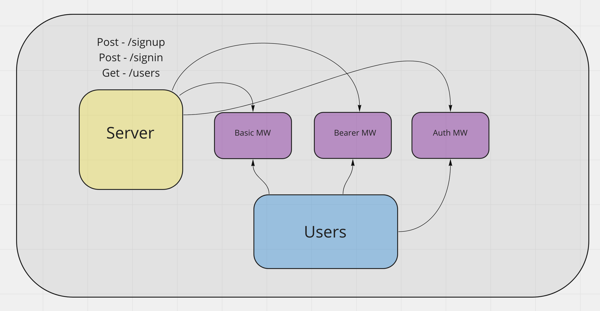

# auth-api

# 401 Lab 08 - Auth Server

**Author: Jessi Velazquez**

**Repository Name:** auth-server

**Branch name:** dev

## Links..

Deployed Link: [https://jessi-auth-server.herokuapp.com/](https://jessi-auth-server.herokuapp.com/)

Github Actions: [https://github.com/JessiVelazquez/auth-api/actions](https://github.com/JessiVelazquez/auth-api/actions)

Pull Request: [https://github.com/JessiVelazquez/auth-api/pull/6](https://github.com/JessiVelazquez/auth-api/pull/6)

## Setup

1. Clone down github repository

2. Run ```npm i``` at terminal to install dependencies

3. Run ```nodemon``` or ```node index.js``` at terminal to start server

## Description

This is a bearer and basic server application that allows a new user to sign up with username and password on the signup route, or validates an existing user's credentials on the /signin route. It includes 4 user types with unique permissions for each.

A valid JSON data object looks like this:

```
{ "username": "sampleUser", "password": "samplePassword", "role": "role___" }
```

## Testing

To run tests, start the server and run ```npm run test``` at the terminal to run all tests

## Architecture

├── LICENSE
├── README.md
├── __test__
│   ├── basic-auth-middleware.test.js
│   ├── bearer-auth-middleware.test.js
│   └── route.test.js
├── index.js
├── package-lock.json
├── package.json
└── src
    ├── error-handlers
    │   ├── 404.js
    │   └── 500.js
    ├── middleware
    │   ├── acl.js
    │   ├── basic.js
    │   ├── bearer.js
    │   └── logger.js
    ├── models
    │   ├── clothes
    │   │   └── model.js
    │   ├── data-collection.js
    │   ├── food
    │   │   └── model.js
    │   └── users
    │       └── users.js
    ├── routes
    │   ├── routes.js
    │   ├── v1.js
    │   └── v2.js
    └── server.js


**Web Request Response Cycle**




## Contributors

Collaborators were Dan Engel, Simone Odegard, Lydia Minehan-Tubic, Julien Edwards.